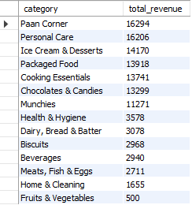
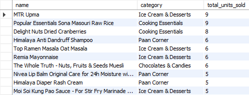
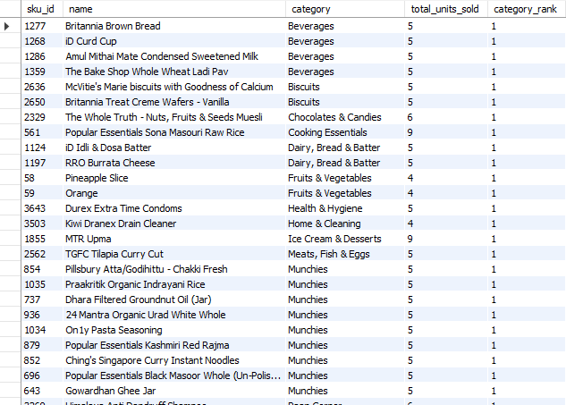
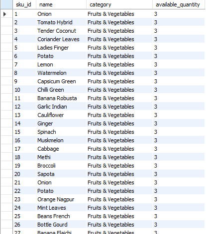

# Zepto Sales & Inventory Analysis

## Overview

This project analyzes Zepto product, sales, and inventory data using MySQL.

The analysis focuses on product performance, pricing and discounts, sales
revenue, customer ratings, inventory levels, and potential stock-related
issues.

## Objectives

- Explore and clean the Zepto product dataset
- Analyze product pricing and discounts
- Analyze sales performance and revenue
- Connect product and sales data using SQL JOINs
- Identify products with low inventory and high sales
- Identify products that have never been sold
- Compare sales revenue with current inventory value
- Identify potentially overstocked products

## Tools & Technologies

- MySQL
- MySQL Workbench
- SQL

## SQL Concepts Used

- SELECT and WHERE
- Aggregate Functions
- GROUP BY and HAVING
- CASE Statements
- INNER JOIN
- LEFT JOIN
- Foreign Keys
- Common Table Expressions (CTEs)
- COALESCE
- Window Functions
- RANK()
- PARTITION BY
- Data Cleaning

## Analysis Performed

### 1. Data Exploration & Cleaning

- Checked for NULL values
- Analyzed product categories
- Checked stock availability
- Identified duplicate product names
- Identified products with zero prices
- Standardized product prices
- Analyzed discounts and price reductions

### 2. Sales Analysis

- Validated sales transaction calculations
- Categorized customer ratings
- Calculated total units sold by product
- Calculated revenue by product
- Calculated revenue by category
- Identified the highest-selling products within categories

### 3. Inventory Analysis

- Identified products with high sales but low inventory
- Identified products that have never been sold
- Calculated inventory value by category
- Compared sales revenue with current inventory value
- Identified potentially overstocked products

### 4. Advanced SQL Analysis

Used CTEs and window functions to:

- Rank products within each category
- Find the highest-selling product in each category
- Find the top 3 products within each category
- Compare cumulative sales revenue with current inventory value
- Identify products where sales revenue exceeds current inventory value

## Key Insights

Based on the SQL analysis:

- Paan Corner generated the highest category revenue at 16,294, followed
  closely by Personal Care at 16,206.

- Fruits & Vegetables generated the lowest category revenue at 500 in the
  analyzed sales data.

- MTR Upma and Popular Essentials Sona Masouri Raw Rice were the
  highest-selling products by units, with 9 units sold each.

- Multiple products had no recorded sales transactions, indicating products
  that may require further investigation from an inventory or sales
  perspective.

- No products met the defined criteria for potential overstock
  (more than 50 units available and fewer than 10 units sold).

- RANK() was used to identify the highest-selling product within each
  category while preserving ties between products with the same sales
  volume.

## Query Results

### Revenue by Category



### Top Selling Products



### Highest-Selling Product by Category



### Products With No Recorded Sales


## Dataset

The project contains two datasets:

- `zepto.csv` — Zepto product and inventory data
- `sales.csv` — Sales transaction data used for the analysis

## Project Structure

```text
zepto-sales-inventory-analysis/
│
├── README.md
├── zepto.csv
├── sales.csv
└── zepto_sales_analysis.sql
